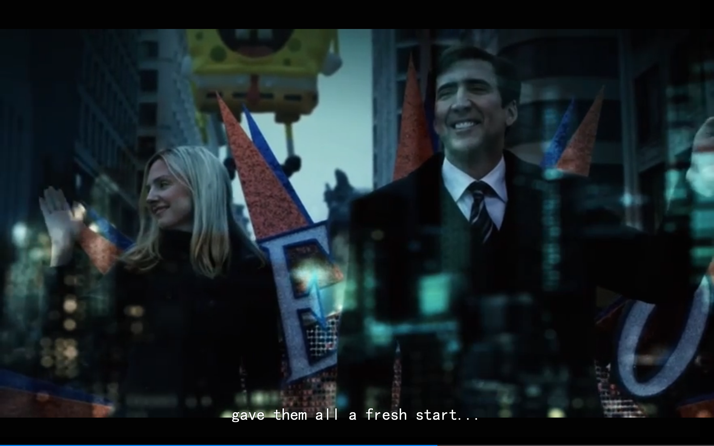
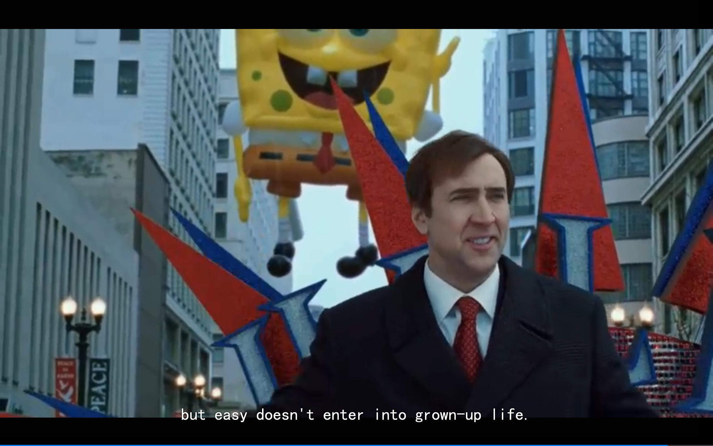
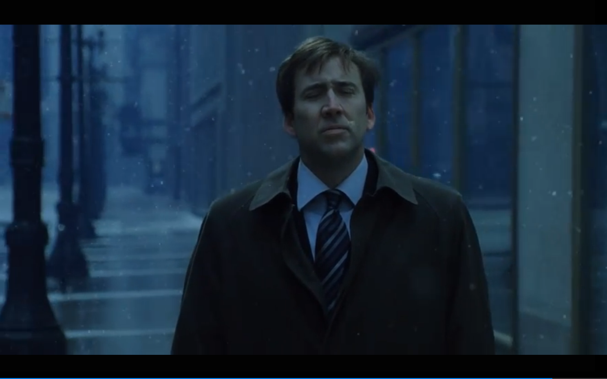

% Movie : The Weather Man 
% 胡浩源 haoyuan.huhy@gmail.com
% 2015年2月22日

# The Weather Man

## subtitle
> The world is a fine plane, and worth fighting for. I agree with the second part.

## Who : main actiors

- The Weather man : Nicolas Cage
- His father : Michael Caine

## What : main plot
- 天气预报员过着表面上的中产生活， 24万美元的年薪， 沃尔沃的S80.
- 和妻子离婚， 儿子被恋童癖骚扰， 女儿因为肥胖被嘲笑， 人们因为他预测的天气向他发怒， 父亲患上癌症
- 此时， 纽约有着一份100w美元年薪的工作等着他。

## Key moment
Cage坐在Caine的车上， 音乐响起《like a rock》。

"David, this shit life, we must chunk them."

## Key words
- We must chunk them in this shit life.
- Things didn't work out the way I expected. Accepting that is not easy, but easy doesn't enter into grown-up life.
- until finally they got reduced to one, to who I am.

## Key Image

## Key Image

## Key Image

## End

But easy doesn't enter into grown-up life.
